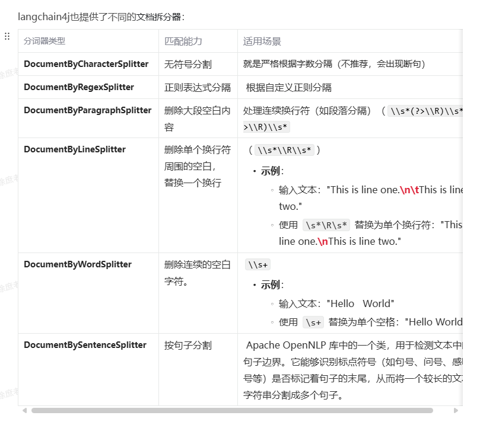
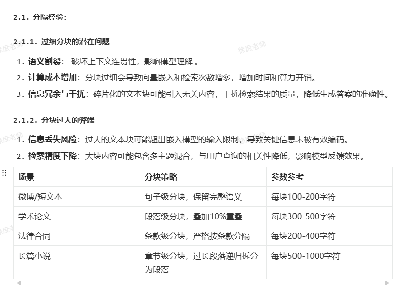
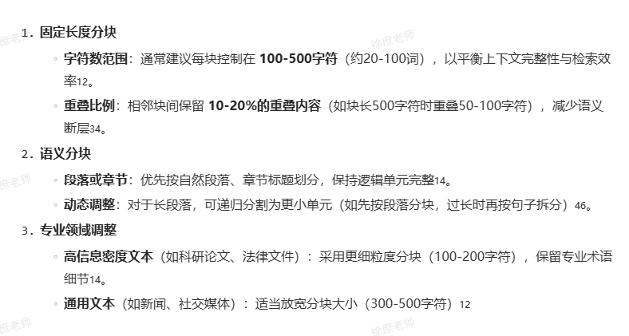

# 读取

Document Loaders 文档读取器

```java
Document document = ClassPathDocumentLoader.loadDocument("rag/terms-of-service.txt", new TextDocumentParser());
```

# 文档拆分

提供了多种拆分方式




## 分割经验






# 文本向量化
